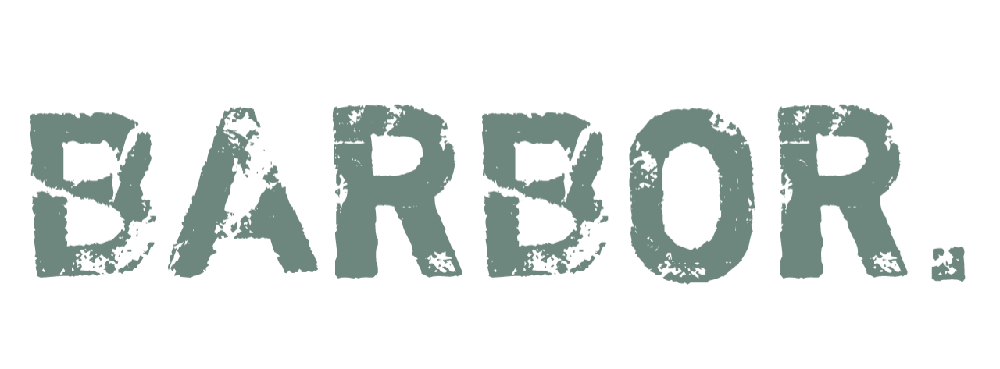

  

  ### Bringing Linux to your Pterodactyl-hosted servers.

&nbsp;

# What is Barbor
Barbor is a script that downloads, configures and runs [Debian Linux](https://debian.org) minirootfs on your Pterodactyl-hosted servers with root privileges and with as little of a footprint as possible creating essentially a type of "virtual machine" out of your server. The goal is to provide a tool that will run on as many hosting services using Pterodactyl as possible using various loaders for the script written in various different languages such as Java, GoLang, Python, etc.

&nbsp;

# Roadmap
- [ ] Full `AARCH64` support.
- [ ] Automatically fetch latest Debian version.
- [ ] Automatic script updater.
- [x] Create some basic wrappers for the script.

&nbsp;

# Getting Started

### Dependencies
* Any hosting provider that utilizes [Pterodactyl](https://pterodactyl.io).
* The hosting provider must allow running unverified applications.

### Minimum System Requirements
The server must have all of the following system requirements to run:
* `x86_64`
* 100 Megabytes Available Disk Space*
* 90 Megabytes Available RAM
* Internet Connectivity

*- You can try running it, it will tell you if your CPU is not supported.  
*- You can probably get away with a tiny little less disk space.

### Help
If you face any errors or issues while using Barbor, feel free to [create an issue](https://github.com/LimanGit/Barbor/issues/new) on our GitHub repository.

&nbsp;

# Authors
* [@LimanGit](https://github.com/LimanGit)

# License
This project is licensed under the GNU General Public License v3.0 license - see the [LICENSE](LICENSE) file for more details.

### Acknowledgments
People who have helped to create and maintain this project in some way.

* [@RealTriassic](https://github.com/RealTriassic) - Original Harbor
